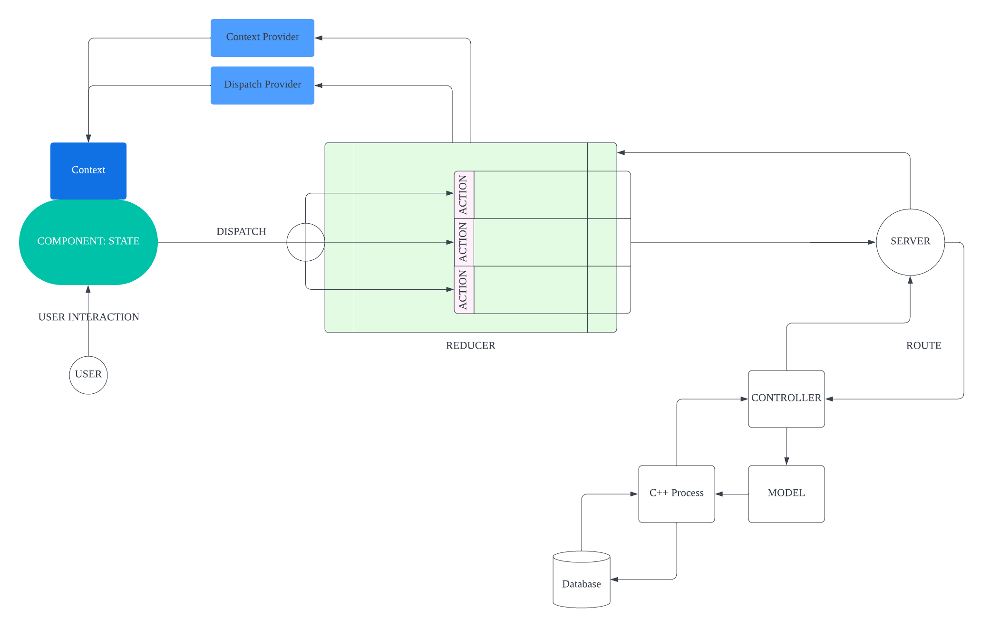

# TekneGram

## Software Design Features
Overall design of the software follows an MVC approach. The front end uses React's context provider and reducer to manage the state of the app. The flow chart below shows the case for one component. As the user interacts with the component, an update is dispatched to the reducer to perform changes to the context. Information is sent to the server where, depending on the action, a route is chosen (using Express). A controller calls a model, which in turn spawns a CPP or an R process, interacting with the database and processing data. This is sent back up through the route to the reducer. The reducer then updates the context provider and finalizes the view for the user.

)
